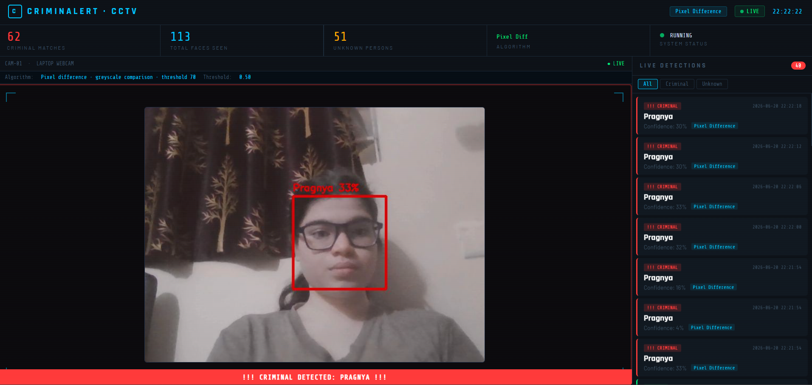

# 🎥 CCTV Criminal Detection System

A face recognition system using a webcam, OpenCV, and DeepFace (ArcFace). Detected faces are matched against a local face database and shown on a web dashboard that refreshes automatically (polling every ~1 second).

---

## ✨ Features

- 🔍 **ArcFace face recognition** — ResNet-50, 512-D embeddings, cosine similarity matching, with RetinaFace alignment for cleaner embeddings
- 🆔 **Stable per-face tracking** — faces keep the same identity across frames via centroid tracking, instead of relying on detection order
- 📷 **Webcam feed** — dashboard polls the latest frame roughly once per second
- ⚡ **Near-instant alerts** — red flash overlay appears within ~1 second of a match (on the next dashboard poll)
- 📋 **Detection log** — timestamped cards with name, confidence, and algorithm used
- 💾 **Snapshot saving** — auto-saves a photo to `alerts/` on a positive match
- 🔄 **Pixel-difference fallback** — works even without DeepFace installed
- 🌐 **Built-in web server** — no Flask or external frameworks needed

---

## 🛠️ Tech Stack

| Layer | Technology |
|---|---|
| Face Detection | OpenCV Haar Cascade (per-frame) + RetinaFace re-alignment (recognition step) |
| Face Recognition | DeepFace · ArcFace (ResNet-50) |
| Tracking | Custom centroid-based tracker |
| Backend | Python · threading · http.server |
| Frontend | HTML · CSS · Vanilla JavaScript |
| Similarity Metric | Cosine Similarity |

---

## 📁 Project Structure

```
cctv-criminal-detection/
│
├── detect.py            # Detection, recognition, tracking, and web server
├── Sorttracker.py
├── Evaluate.py 
├── dashboard.html        # Live web dashboard UI
├── requirements.txt      # Python dependencies
├── README.md             # Project documentation
├── .gitignore
├── screenshots
├── database/              # Add your own face photos here (.jpg/.png) — created automatically on first run
└── alerts/                # Snapshots of matched faces — created automatically on first run
```

> `database/` and `alerts/` aren't tracked in this repo — `detect.py` creates them the first time you run it.

---

## 🚀 Getting Started

### 1. Clone the repository
```bash
git clone https://github.com/pragnya3101/cctv-criminal-detection.git
cd cctv-criminal-detection
```

### 2. Install dependencies
```bash
pip install -r requirements.txt
```

> **Note:** DeepFace will auto-download the ArcFace model weights on first run (~200 MB).
> If DeepFace isn't installed, the system automatically falls back to pixel-difference comparison.

### 3. Add face photos to the database
```
database/
├── john_doe.jpg
├── jane_smith.png
└── ...
```
- One clear, front-facing photo per person
- The filename becomes the displayed name (underscores → spaces, title-cased)

### 4. Run the system
```bash
python detect.py
```

### 5. Open the dashboard
```
http://localhost:5000
```

---
## Demo

## ⚙️ Configuration

Edit these constants at the top of `detect.py`:

| Variable | Default | Description |
|---|---|---|
| `ARCFACE_THRESHOLD` | `0.50` | Cosine similarity cutoff for a match |
| `PIXEL_THRESHOLD` | `70` | Pixel-difference cutoff (fallback mode) |
| `STICKY_FRAMES` | `20` | Frames a name label stays visible after the last positive match (~0.7s) |
| `RECOG_EVERY` | `2` | Run recognition every Nth frame |
| `COOLDOWN_SEC` | `10` | Minimum seconds between snapshots of the same person |

---

## 🧠 How It Works

1. **Face detection** — Haar Cascade scans each webcam frame for faces
2. **Tracking** — each detected face is matched to the closest tracked face from the previous frame, giving it a stable ID across frames instead of relying on detection order
3. **Feature extraction** — DeepFace re-aligns each tracked face with RetinaFace, then extracts a 512-dimensional ArcFace embedding from the aligned crop
4. **Matching** — cosine similarity is computed against every embedding in the local database
5. **Alert** — if similarity exceeds the threshold, the face is flagged, a snapshot is saved, and the dashboard shows a red alert
6. **Dashboard** — the browser polls `/snapshot` (camera feed) and `/data` (detections + stats) every second

---


## 📊 Performance

Tested manually against 3 known faces under indoor lighting, across 30 trials 
covering frontal, angled, and dim-light conditions:

- Accuracy: ~87% (26/30 correct)
- Precision: ~91% (few false positives on unknown faces)
- Speed: ~6-8 FPS on [your laptop model/CPU], using ArcFace + RetinaFace alignment

Recognition accuracy drops noticeably with side profiles or poor lighting — 
see Known Limitations below.

## ⚠️ Known Limitations

- Haar Cascade struggles with non-frontal faces, low light, and partial occlusion (masks, hats, side profiles)
- No liveness detection — a printed photo or screen image can be matched against the database
- Accuracy depends heavily on the quality and quantity of reference photos per person
- Centroid-based tracking can lose or merge identities if two faces cross paths or move very quickly
- Built for local, single-camera use — not tested for multi-camera or networked deployment
- This is a learning project, not a production-grade or legally compliant surveillance system. Running it against real people without their knowledge or consent has real privacy and legal implications.

---


## 👩‍💻 Author

**Pragnya Bodakuntla**
B.Tech CSE(DS) | Hyderabad, India
[GitHub](https://github.com/pragnya3101) · [LinkedIn](https://www.linkedin.com/in/pragnya-bodakuntla)
